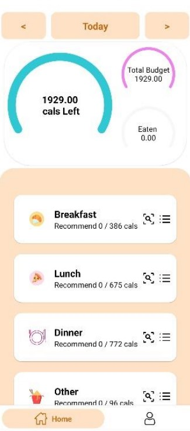
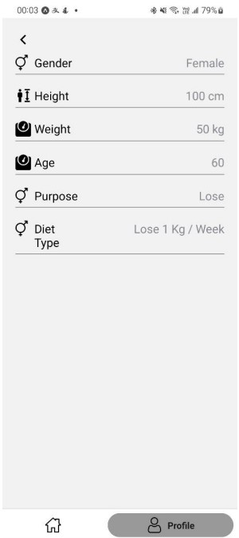
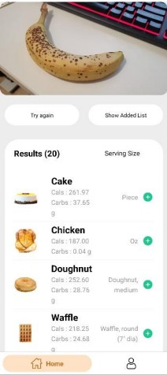
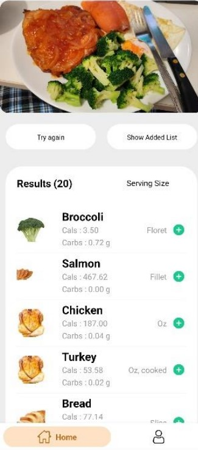

# comp-4342-project

&nbsp;
&nbsp;

## Introduction

This application revolutionizes the way we interact with food and nutrition data. It allows users to capture or select a picture and send it to our server with ease. Leveraging advanced object detection skills, the app accurately identifies various types of foods within the images. And returning the nutrition information.

## View the documentation:
[Documentation Link](https://github.com/CSW0126/comp-4342-project/blob/main/Report/COMP4342%20Report.pdf)

## Some Screenshots

 

